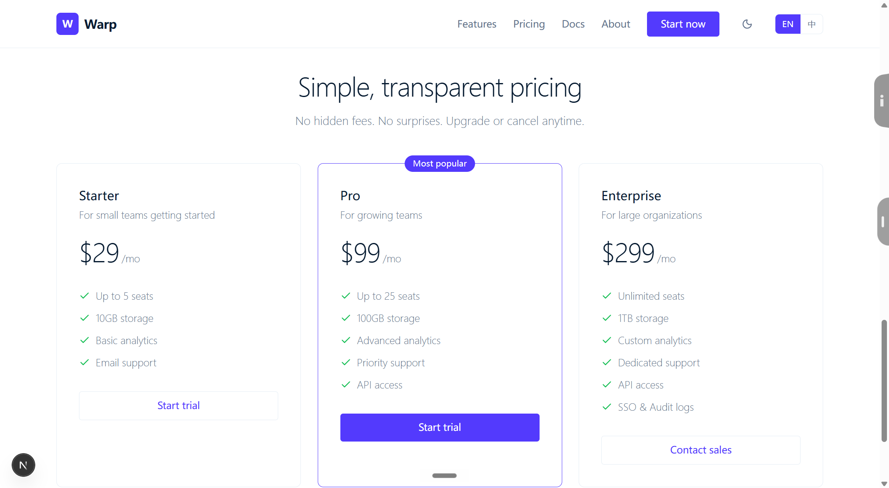

# Warp UI

A SaaS branding landing page inspired by Stripe's design system. Built with Next.js and Tailwind CSS.

## Live Demo

[https://warp-ui-five.vercel.app](https://warp-ui-five.vercel.app)

## Screenshot



## Tech Stack

| Layer | Technology |
|-------|-----------|
| Framework | Next.js 16 (App Router) |
| Styling | Tailwind CSS, CSS Variables |
| Icons | Lucide React |
| Features | Multi-language (EN/ZH), Dark/Light theme |

## Features

- **Stripe-inspired Design** — Clean white canvas, deep navy headings, purple accent, weight-300 typography
- **Multi-language** — Toggle between English and Chinese
- **Dark/light Theme** — CSS variables power seamless theme switching
- **Responsive** — Mobile navigation with hamburger menu
- **Sections** — Hero, trust bar, feature grid, dark brand section, pricing cards, footer

## Getting Started

```bash
npm install
npm run dev
```

Open `http://localhost:3000`.

## Project Structure

```
src/
├── app/
│   ├── globals.css        # Theme CSS variables
│   ├── layout.tsx         # Root layout with providers
│   └── page.tsx           # Single-page landing
├── lib/
│   ├── i18n.ts            # EN/ZH dictionary
│   ├── i18n-context.tsx   # Translation provider
│   └── theme-provider.tsx # Theme toggle provider
```
